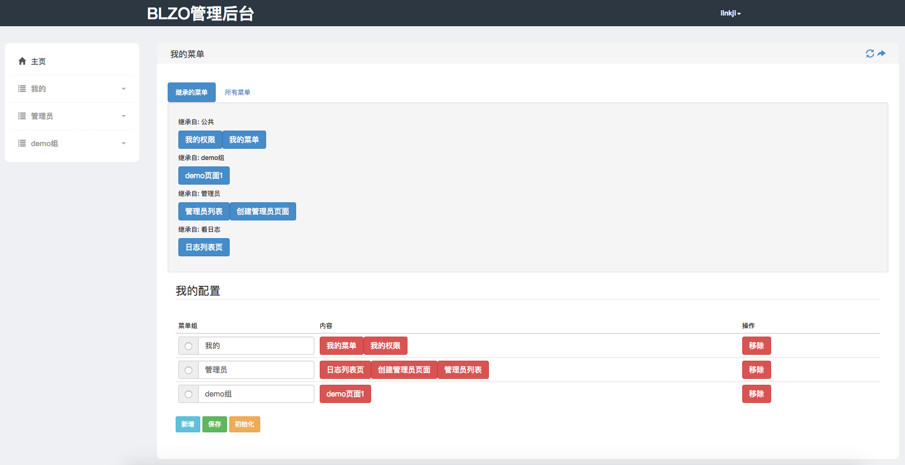

<p align="center">
    
    <h3 align="center">BLZO！超级脚手架！</h3>
    <p align="center">
        基于springboot的企业级快速开发脚手架.<br><br>
        <a href="https://github.com/jdkhome/blzo">
            
        </a>
        <a href="https://gitee.com/jdkhome/blzo">
            
        </a>
    </p>
</p>


> BLZO是一个基于springboot的企业级快速开发脚手架。包含了一个简单易用(无论是对用户还是开发者)且功能强大的管理后台！十分适合中小型项目快速迭代。  
> 使用 [jdk11](http://openjdk.java.net/) 环境，[gradle 4.10/5.0](https://gradle.org/) 或以上版本 推荐使用[idea](https://www.jetbrains.com/idea/)进行开发  

市面上的权限管理脚手架有很多，如果你正在寻找合适的项目，请一定继续阅读，本项目的权限管理，相对其他项目(要手动配置权限地址、菜单的)，具有**极大**的优势！

[点这里前往 BLZO的 jdk8+springboot2.0 版本](/jdkhome/blzo-jdk8)

## 感谢：

主要技术栈:

- [springboot 2.1](https://github.com/spring-projects/spring-boot)
- [redis](https://github.com/antirez/redis)
- [mysql 5.7](https://github.com/mysql/mysql-server)
- [mybatis-3](https://github.com/mybatis/mybatis-3) & [mybatis-generator](https://github.com/mybatis/generator)
- [thymeleaf 3](https://github.com/thymeleaf/thymeleaf) 
- [bootstrap 3](https://github.com/twbs/bootstrap)

用到的其他项目:

- [Bootstrap-Admin-Theme-3](https://github.com/VinceG/Bootstrap-Admin-Theme-3) 管理后台前端模板
- [apidoc](https://github.com/apidoc/apidoc) 生成接口文档
- [ip2region](https://gitee.com/lionsoul/ip2region) ip地址定位库

诚挚感谢以上所有项目！(当然远不只是以上！感谢你们！)

---

## 项目描述：

包含 3个模块 

- common : 公共模块，可以将常量、枚举、工具类 等内容放在这里
- core : 业务模块，根据你的业务复杂度，扩展多个不同的业务模块
- manage : 管理后台，完全不侵入业务的管理后台，提供了一套使用简单却功能强大的权限菜单管理功能

业务方面，目前只做了一些基础且通用的功能(或代码示范)，比如 请求日志、异常处理、参数校验等。
未来可能会整合一些通用的业务代码进来。

管理后台，实现了完整的权限管理功能:

对于用户:

- 可以自由创建管理员账户
- 管理员可以创建分组，可以将自己拥有的权限授权给自己创建的分组，权限可以是页面也可以精确到某个具体的按钮
- 分组的创建者可以将其他管理员加入到分组中，该管理员就会获得这个分组中被赋予的权限
- 得到的权限可以继续授权给新的分组，并继续传递
- 权限的传递是基于继承关系的，当管理员失去了某个权限，那么所有由他传递出去的这个权限都会被收回，无论何时授权、传递了多少级
- 每个用户都可以自定义自己的功能菜单

> 一个通俗易懂的场景: 我是小组组长，我可以为我的下属分配一些我有的权限，并且可以随时收回

[视频演示](https://www.jdkhome.com/uri/ZGFO)

截图:  
我的权限:

我的菜单:


试用(请不要修改root用户的密码，如果无法登录请联系我，数据库会定期重置，请不要搞事蟹蟹！):
```
http://blzo-manage.jdkhome.com
root
1234abc
```

对于开发者:

一般来说，如果要实现支持用户自定义权限、自定义权限传递(组 或者 角色) 这样灵活的功能，不可避免的要有很多配置：  
有的保存在数据库里，有的使用json/xml做成配置文件。  
大多数情况，都需要开发者将完成的功能配置成权限，而在项目快速迭代的过程中，配置权限就会显得十分麻烦。  
如果删除了某个功能，或者修改了页面/接口的URI，这时候还要去另外去维护权限的配置，总之，我认为这样对开发人员很不友好。  
即使你提供了图形界面，把上面这些麻烦事抛给用户依然不能从根本上解决问题。

那么现在介绍使用 BLZO ，如何轻易的完成这件麻烦事。

```
/**
 * author link.ji
 * createTime 下午3:17 2018/12/5
 * Demo
 */
@Slf4j
@Controller
public class DemoController {

    /**
     * 代表这个接口 的名称是 "demo接口1" 它需要鉴权 它不能作为菜单 它不属于公共权限
     * @return
     */
    @Authj(value = "demo接口1", auth = true, menu = false, common = false)
    @ResponseBody
    @RequestMapping(value = "/api/manage/demo/api_1", method = RequestMethod.POST)
    public ApiResponse apiManagerDemoApi1() {
        return ApiResponse.success();
    }

    /**
     * 代表这个页面 的名称是 "demo页面1" 它需要鉴权 它可以作为菜单 它不属于公共权限
     * @return
     */
    @Authj(value = "demo页面1", auth = true, menu = true, common = false)
    @RequestMapping("/manage/demo/page_1")
    public String groupAuth() {
        return "manage/demo";
    }


}
```
仅仅只需要在方法上增加一个 ```@Authj``` 注解！  
你可以随时修改、删除接口/页面的名称、URI 或者一切你想要变动的东西！  
将100%的精力花在业务上,再也不用去关注那些权限配置、菜单配置了！

root用户(超级管理员) 会获得由 ```@Authj``` 注解标注的所有页面、接口的权限，并进而将这些权限授予更多管理员！

## 快速开始:

todo(待编写。。。)